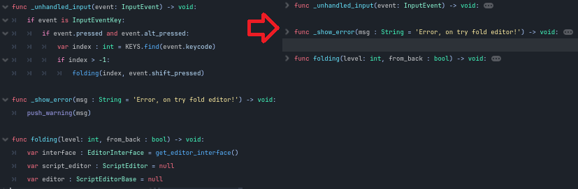

# Quick-Folds
 

Tool addon for code editor in Godot 4

Allow quick and custom folding for all lines in the editor using the keyboard.

# How Work
* Press **Atl + Num[0 - 9]** (start by number 1) to change fold level
> Like American Keyboard from left to right: Atl + 1 , Atl + 2 ... Atl + 9, Atl + 0

* (Inverted): Press **Shift + Num[0 - 9]** (start by number 1) to change inverted fold level
> Like American Keyboard from left to right: Shift + Atl + 1 , Shift + Atl + 2 ... Shift + Atl + 9, Shift + Atl + 0

### Quick Example:

* Atl + 1 for collapse all lines
* Shift + Atl + 1 for show all lines

# Preview

#
Copyrights (c) CodeNameTwister. See [LICENSE](LICENSE) for details.

[godot engine]: https://godotengine.org/
